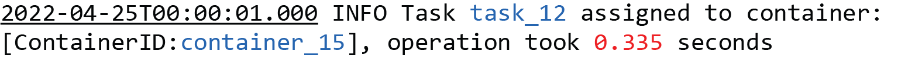
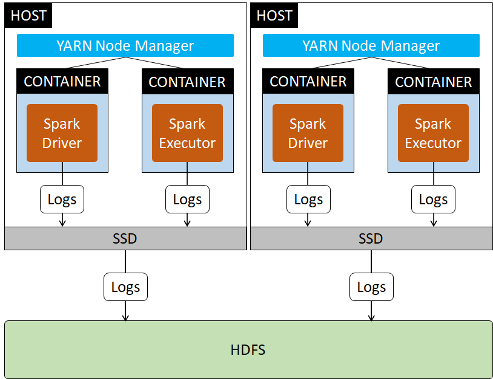
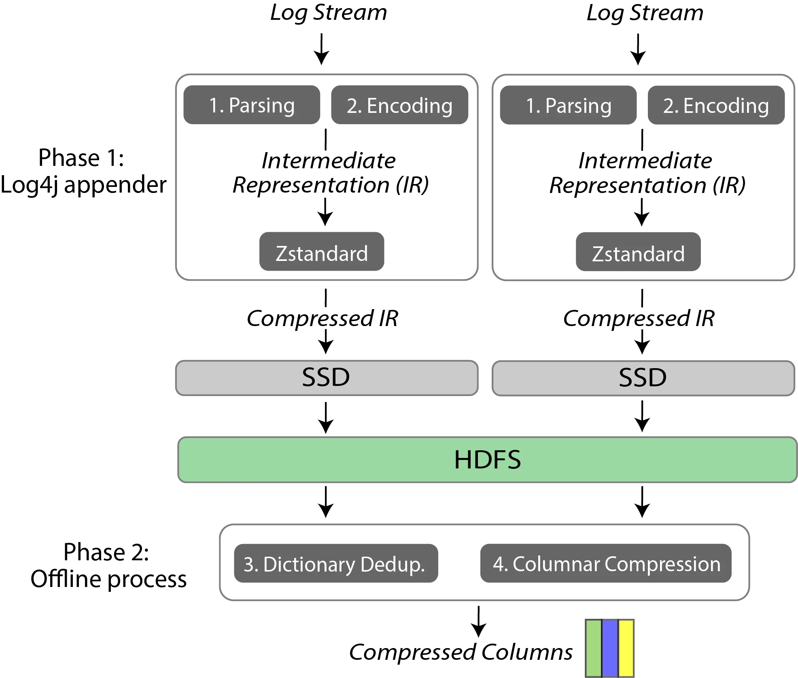
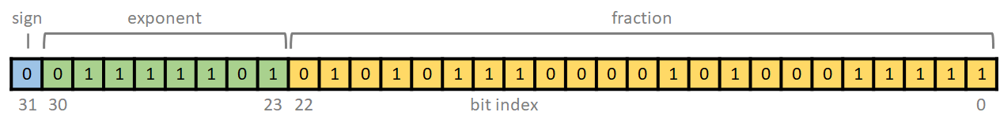

# Reducing Logging Cost by Two Orders of Magnitude using CLP

https://www.uber.com/en-US/blog/reducing-logging-cost-by-two-orders-of-magnitude-using-clp

September 29 / Global

Long, long ago, the amount of data our systems output to logs was small enough that we were able to retain all of the log files. This allowed our engineers to freely analyze the logs, say for troubleshooting our systems or improving applications. But as Uber’s business grew rapidly, the amount of data being logged increased dramatically. And so we were forced to discard log files after just a short period of time, given the prohibitive cost of retaining them–that is, until we integrated [CLP](https://eng.uber.com/logging/) into the logging library (Log4j) of our big data platform. In aggregate, CLP achieves a 169x compression ratio on our log data, saving storage, memory, and disk/network bandwidth at every level. As a result, we can now retain all logs at a fraction of the cost, without throwing away any insights, and the compressed logs can be efficiently searched without decompression.

At Uber, we rely on making data-driven decisions at every level. For this, we have built a large-scale big data platform that runs over 250,000 Spark analytics jobs per day, where each job could consist of hundreds of thousands of executors, processing over a hundred petabytes of analytical data. In addition, the big data platform generates a large amount of log data, and the rapid growth of Uber’s business has led to furious growth of these logs. On a busy day, our Spark cluster alone can generate up to 200TB of logs (at the default INFO verbosity level). 

These logs are critical to both the platform engineers and data scientists using Spark. Analyzing logs can be used to improve the quality of applications, troubleshoot failures or slowdowns, analyze trends, monitor anomalies, and so on. Many of these analyses require logs collected over a long period of time. For instance, when Spark jobs fail or stall, our on-call engineers may abruptly restart them to quickly mitigate operational issues, but they need older log data to identify the root cause postmortem. Other users want to compare log data week by week to identify anomalies and identify trends. Data scientists want to examine old Spark logs to examine and improve the quality of their machine learning applications. As a result, our users would frequently ask our infrastructure team to increase the log retention period from three days (the period at the time) to at least a month.

However, if we were to increase the retention period to a month, just our HDFS storage costs would reach millions of dollars per year. Moreover, the scale of our logs prevents existing tools from managing the logs cost effectively. For example, Elasticsearch incurs prohibitive operational and hardware costs (among other challenges) in scaling to Uber’s logging workload, so much so that we were forced to migrate away from it. For our non-Spark logs, we currently ingest them into [ClickHouse](https://eng.uber.com/logging/), but ClickHouse is more suitable for structured logs (our Spark logs are mostly unstructured whereas our non-Spark logs are mostly structured, i.e., JSON). In addition, we are concerned about storage costs: one month worth of Spark logs would more than double the current size of data stored in ClickHouse for all the other services combined.

Unfortunately, as our log size continued to grow, things got worse: our SSDs started to burn out prematurely. Log files are typically written a few messages at a time, spread out over the duration of the job. On our memory-constrained systems, this causes many small writes over a long period of time, which in turn causes SSD write-amplification. As a mitigation, we **reduced** the logging level from INFO to WARN, but this is contrary to what our users want!

For a long-term solution, we decided to explore compression within the logging library (to reduce writes to the SSD). We found [CLP (Compressed Log Processor)](https://github.com/y-scope/clp/), a tool with unprecedented compression (2x of general-purpose compressors) while preserving the ability to search the logs without full decompression. CLP required some customization since it was designed to compress batches of files at a time, whereas our logging library writes a single log file at a time. Specifically, we split CLP’s algorithm into two phases: Phase 1 is suitable for compressing a single log file at a time while achieving modest compression; Phase 2 aggregates these compressed files into CLP’s final format.

After implementing Phase 1, we were surprised to see we had achieved a compression ratio of 169x. Without compression, storing the logs for three days used to cost us $180,000/year and a one month retention period would cost us a whopping 1.8 million/year. With just Phase 1, this cost is reduced to $10,000/year for a one month retention period. But more importantly, it now enables us to retain the logs as our engineers requested: we were able to restore the logging level from WARN back to INFO, increase our retention period by 10x, and still reduce our storage costs by 17x. We are still implementing Phase 2, but our preliminary results show it will deliver even higher compression (2x) and storage savings, while enabling powerful search and analytics.

The rest of this blog details why we chose CLP over other compressors, how we split CLP’s algorithm into two phases, how we integrated CLP as a Log4j appender, an interesting improvement we made for encoding floating-point numbers, the results of deploying Phase 1, and finally, what comes next.

## Why Not Use a General-Purpose Compressor?

General purpose compressors are not ideal for our purposes for a few reasons. First, they do not exploit the unique characteristics of logs, resulting in a suboptimal compression ratio. Compared to other textual data, logs are much more repetitive. Consider the following example log message:

It consists of three components: a timestamp (underlined), three variable values (in blue and red), and the static text (the remainder) which is also known as the log type. Among them, the log type is static, so it never changes; in addition, some variable values are also highly repetitive, such as the task ID and container ID. However, the highly repetitive components are intertwined with other components. For example, messages of the same log type could be interleaved by logs of different log types. This limits Zstandard or Gzip’s ability to find repetition, because it can only identify repetitions within a sliding window. Even within the same log message, the log type is interleaved by variables. Zstandard or Gzip do not allow gaps in the repetitive pattern; therefore when a log type is interleaved by variable values, they can only identify the multiple substrings of the log type as repetitive. In the above example, say a subsequent log message has the same log type but different variable values, Zstandard will identify 4 repetitive substrings in the log type: “ INFO Task ”, “ assigned to container: [ContainerID:”, “], operation took ”, and “ seconds”  instead of a single log type. 

In addition, general purpose compressors are not designed with search in mind: searching the logs requires decompressing the entire compressed file. Most of the time, users would only like to examine a subset of logs that satisfy certain filters, such as a particular application ID, a particular host, or a search phrase. But filters can only be applied after decompressing the entire compressed log back to plain text.

In contrast, CLP compresses the logs and allows search directly on the compressed logs. CLP parses the unstructured logs and turns them into a structured table, where each message is a row and the different components including the timestamp, log type, and variables, are different columns. CLP deduplicates those highly repetitive columns using dictionaries and only a dictionary index is stored in the table instead of the raw string. CLP finally compresses this table using Zstandard, but in a column-oriented manner, significantly increasing its capability to find duplication. As a result, CLP has an unprecedented compression ratio (significantly exceeding the capabilities of Gzip or Zstandard alone), while allowing users to search the compressed logs without decompression back to plain-text, as it’s enabled by using the dictionaries as indexes.

Next, we briefly overview our logging architecture and the internals of CLP, before explaining how we integrated CLP into our architecture.

## Logging Architecture for our Spark Cluster

Figure 1: The logging architecture of our Spark cluster. While a job is in progress, its logs are written to the container host’s SSD. When a job completes, the YARN Node Manager uploads the logs to HDFS.
Figure 1 shows the current logging architecture of our Spark cluster. We primarily run Spark jobs in containers using YARN as the resource manager. While a job is running, logs are first written to the locally attached SSD on each container host. When the job completes, we use YARN’s log aggregation feature to copy the logs from each host’s SSD to HDFS.

Logs are primarily written using Log4j, a logging library used by Spark and many other big data platforms. Log4j allows developers to use custom logic to persist log messages, in the form of a Log4j appender. For instance, developers can configure Log4j to use a SocketAppender that will send log messages over the network to some endpoint. As we’ll see later, a Log4j appender is a convenient way for us to compress logs as they are generated, before they are written to disk.

## Background of CLP

Figure 2: How a log message is compressed using CLP. 
Figure 2 shows how CLP compresses an example log message in four steps. In the first step, CLP deterministically parses the message into a timestamp, a list of variable values, and the log type. It further recognizes that some variable values like task ID and container ID are likely repetitive, whereas others, like floating-point numbers or integers are non-repetitive. The former are called dictionary variables because they will be stored in a dictionary whereas the latter are called non-dictionary variables. 

The next two steps convert the different string components into concise binary values. In step 2, CLP encodes the timestamp and non-dictionary variables. For timestamps, it encodes the delta in milliseconds (compared to the timestamp of the last message) using a variable-length encoding scheme, hence most timestamps only occupy one or two bytes. Floating-point numbers are encoded using our custom algorithm described below. In step 3, each repetitive variable is deduplicated using a dictionary. Similarly, the log type is also deduplicated using a separate (log type) dictionary.

In the last step, CLP converts the log messages into a table of encoded messages consisting of three columns: the timestamp, a list of variable values (either the variable dictionary IDs or encoded non-dictionary values), and the log type ID. Once a number of log messages is buffered, each column is compressed (in column-oriented order) using Zstandard. The dictionaries are also compressed separately using Zstandard. 

## Integrating CLP into Uber’s Big Data Platform

Initially, we planned to implement all of CLP’s compression logic into the Log4j appender. However, we quickly realized we need a streaming compressor that uses a minimal amount of memory; this is because logs are generated in a streaming fashion and our container hosts are often under high memory pressure as Spark is a data-heavy platform. However, CLP’s full compression imposes a few issues. First, it requires buffering a large number of encoded log messages in memory before compression. Buffering is needed so that CLP can compress the encoded messages in columnar order. This buffer, together with the dictionary, also requires up to hundreds of megabytes of memory. Finally, CLP achieves its best compression ratio when aggregating logs from multiple nodes or JVMs (rather than each file individually), which is infeasible within a single appender.

Figure 3: Splitting CLP compression deployment into two phases in our deployment. 
Instead, we split CLP’s compression into two phases. Figure 3 shows this architecture. Only Phase 1 runs in the Log4j appender, and it performs lightweight, streaming compression. There is one Log4j appender running in each JVM, compressing the stream of log messages generated by the Spark application running inside that JVM before writing the compressed logs to disk. The appender only performs the first two steps of CLP’s compression (as shown in Figure 2), namely parsing and encoding. After parsing and encoding, a log message is converted into an intermediate representation (IR), which is sent directly to a Zstandard compression stream without being buffered. As a result, each appender outputs a stream of compressed IR, which will be stored on the SSD of each container host. Like before, the compressed IR will be uploaded to HDFS by YARN’s log aggregation feature. Afterwards, we use an offline dedicated process to aggregate multiple compressed IRs, and run the rest of CLP’s algorithm (steps 3 and 4 in Figure 2) to fully compress the logs into CLP’s compressed columns format.

Figure 4: IR format of the example log message. <H> represents the header. 
Figure 4 shows the IR format of the example log message that is designed for streaming compression. The IR consists of a list of <header><payload> pairs, where a payload is a component parsed from the log message. In Figure 4, the message consists of five components: the logtype, three variable values, and the timestamp delta (0xE3).

The header for dictionary variables and the log type typically consists of two bytes: one indicates the type of the payload (i.e., dictionary variable, log type, etc.), and the other records the length of the payload. We use a variable-length encoding for the length, so the length of most payloads only requires one byte. For timestamp deltas and non-dictionary variable values, their header uses one byte to encode both the type and length. For example, the timestamp delta could require either 1, 2, 4, or 8 bytes. Hence we have four different type values for timestamp deltas. Similarly, non-dictionary values like floating point numbers or integers could also have different lengths, and they are embedded in the type byte. A careful reader might notice that we actually do not need to embed the length of these encoded variables into the type: because these variables are already encoded, their length can be determined from their encoding (for example, the encoded timestamp already uses variable-length encoding). But doing this would complicate our parsing logic. For log type and dictionary variables, we cannot embed their lengths in the type byte because their length could have an infinite number of possibilities. 

To reduce the appender’s memory footprint and SSD write-amplification, we use a few optimizations. First, we do not need to allocate space for dictionaries in Phase 1 because dictionary deduplication is only done in Phase 2. We also do not buffer uncompressed logs: after parsing each log, we directly send the partially encoded message to the Zstandard streaming compressor. This minimizes our memory usage. We do, however, use a 4MB buffer for the compressed logs, so compressed logs are written to the SSD 4MB at a time (or if the log file is closed before 4MB is reached). 4MB is carefully chosen as it’s a multiple of all block sizes for commonly used SSDs. Hence our writes to the SSD will minimize write-amplification. A small 4MB buffer is highly effective: on average, a 4MB of compressed logs translates to 400MB+ of uncompressed logs for us, given CLP + Zstandard’s more than 100x compression ratio. 

Splitting CLP’s compression into two phases is also economical. The performance of CLP’s end-to-end compression logic (Figure 2) is bottlenecked by log parsing. We now distribute log parsing to each Log4j appender, leveraging the fact that the CPUs of the containers running Spark jobs are often underutilized. As a result, Phase 2’s compression can be significantly less CPU intensive given that it no longer needs to parse the logs.

A few tools in the Hadoop/Spark ecosystem allow users to view a job’s logs. These tools expect the logs to be in plain-text format or in a special file-type (written by the [LogAggregationFileController](https://hadoop.apache.org/docs/r3.3.2/hadoop-yarn/hadoop-yarn-common/apidocs/) family of classes) that YARN uses to concatenate several logs together. Since our appender writes logs in a specialized format, we had to extend the tools so that they could also read our format. This was as simple as adding an if branch in the few places a log file is read—if the log file’s extension is CLP’s, then we transparently decompress the desired chunk of the log, otherwise we run the existing code to read the uncompressed log.

### Why not use a socket appender to send the logs directly over the network, completely bypassing the SSD? 

We considered this, but implementing CLP in the appender has a few noteworthy advantages. First, log ingestion services are costly to maintain and are frequently the scalability bottleneck for a log-storage solution. In addition, some tools in the Hadoop/Spark ecosystem rely on having the logs accessible from disk/HDFS rather than a log-storage service, so integration is less intrusive if we keep the logs stored on the filesystem.

### Advantages over directly compressing the original log with Zstandard 

First, recall that CLP-compressed logs are searchable–a user query will first be directed to dictionary searches, and only matching log messages will be decompressed. Additional metadata columns can be easily added to each encoded message to enable additional filtering, such as application ID, host name, etc. 

Even our appender’s compressed IR provides better filter/search capability compared to directly compressing with Zstandard. Although the IR lacks dictionaries, search still could skip components because the log message is already parsed. For example, if a user only wants to examine logs within a certain time period, we only need to examine the timestamp component, and skip the other components of the messages that are outside of the time range. Also, some existing search tools like grep cannot natively handle a log message that spans multiple lines (such as a stack trace in an error log): grep only returns a single matching line, instead of the complete multi-line message. But since our IR consists of parsed logs, a search can always return the entire message even when it spans multiple lines. 

CLP also achieves a much higher compression ratio compared to directly applying Zstandard or Gzip, due to its columnar-based storage format and concise encoding, both of which enable Zstandard to find significantly more duplications within its sliding window. The compression ratio of end-to-end CLP is 2.16x higher than Zstandard’s and 2.28x higher than Gzip on our Spark logs. Even our appender’s compressed IR, which is only Phase 1 of CLP’s end-to-end compression, achieves a compression ratio 5-8% better than directly applying Zstandard on the raw logs. This is because, by separating the highly repetitive log types and dictionary variables, Zstandard can find longer repetitive patterns. Recall that for the log type in the example log message, Zstandard will identify 4 repetitive substrings: ” INFO Task “, ” assigned to container: [ContainerID:”, “], operation took “, and ” seconds”. However, in our appender, Zstandard can identify the entire log type string as repetitive. In addition, our concise encoding of timestamps and non-dictionary variables, specifically floating-point numbers, also results in higher compression ratio. 

Next, we describe the custom floating-point number encoding we invented that increased the  encoding speed by up to 2-3x, while simultaneously improving compression ratio and representing more floating point values printed in the logs in a lossless manner. 

## Custom Floating-Point Number Encoding

Figure 5: Representation of 0.335 using our custom float encoding 

Figure 6: IEEE-754 single-precision (32 bits) representation of 0.335

In implementing CLP, we made one notable optimization: a custom float encoding. Recall that CLP directly encodes a floating point value, such as “0.335”, into a 32-bit value in the encoded message. Originally, CLP encoded floating point values using the IEEE-754 standard. However, the IEEE-754 standard is not ideal for log compression purposes for a few reasons. First, encoding/decoding IEEE-754 values from string is slow. In addition, IEEE-754’s format is not lossless. For example “2.3456789” cannot be accurately represented by the IEEE-754 32-bit standard. As a result, if we encode “2.3456789” as an IEEE-754 float and then decode it back to a string, the value would be modified to “2.3456788”, where the last digit is modified. Similarly, values like “0.100” (trailing 0) and “00.01” (multiple leading zeros) cannot be encoded and decoded without storing the precision and number of digits separately; the original CLP stores these values in the log type, causing some log types to be duplicated if the precision of a variable differs between log messages. Our custom floating-point encoding overcomes these issues. Figure 5 shows our protocol, representing the floating point value 0.335 in 32 bits. It encodes the value with the following format (from MSB to LSB):

- 1 bit (b31): Is negative
- 25 bits (b30-6): The value of the floating point number without the decimal point and without the sign, as an integer. For example, for 0.335, these 25 bits represent the value of 335.
- 3 bits (b5-3): The total number of printed digits, minus 1. Thus, it can represent a value with a total number of digits between [1, 8], mapped to the range [0, 7]. In the case of “0.335”, there are a total of 4 digits, so the value of these 3 bits is 3. We use three bits because a 25-bit number has at most 8 decimal digits (2^25 -1 = 33,554,431). 
- 3 bits (b2-0): Offset of the decimal point, from the right, minus 1. For example, for 0.335, the offset of the decimal is 3. Note that we take the offset from the right instead of the left because a negative sign might “waste” a value if we do so from the left. For example, if we count from the left, then the offsets of the decimal are different for 0.335 and -0.335, but they’re the same when counting from the right.

Note that we need both the number of printed digits (b5-3) and offset of the decimal (b2-0), because there can be an arbitrary number of leading zeros. For example, “0.335”, “.335”, “000.335” all have the same integer values (b30-6) and decimal offset (b2-0); therefore we need b5-3 to differentiate them (where there are 4, 3, and 6 digits respectively).

This representation can precisely represent any floating point value whose integer value ignoring the decimal point falls in the range [-(2^25-1), (2^25-1)]. Any value that cannot be precisely represented by this protocol will be treated as a dictionary variable, guaranteeing lossless decompression.

Our custom encoding consistently achieves a 2-3x speedup compared to IEEE-754, when evaluated on the floating point values extracted from our Spark logs. This results in a non-trivial speedup for compression. Note that the encoding logic is run not only on floating-point values, but on any token that is a candidate floating-point number, i.e., those that consist of a number character and which aren’t integers (examples include “23:59:59” or “2.4.3-uber-159”). This is because without first running through the floating-point number encoding process, we can’t rule out that the token is not a floating point value. 

Interestingly, we also find that using our custom floating-point number encoding **improves the compression ratio by 5.37%** when applied to our Spark logs. As mentioned earlier, this is partly because, compared to IEEE-754’s format, our custom format avoids duplicating log types when only the precision of the floating point value differs. In addition, IEEE-754’s format could have higher entropy than our encoding. For instance, compare the encoding of 0.335 in IEEE-754 (Figure 6) versus our custom encoding (Figure 5). There is a lot more entropy (frequent switching between 0 and 1) in the IEEE-754 encoded value, leading to lower compression for IEEE-754 values. More importantly, a small difference between two floating-point values often leads to a large difference in the bit sequence when they are encoded in IEEE-754. For example, the lower 16 bits of IEEE-754 encoded value for “0.334” differ with “0.335”, even though their actual values only have small differences. Hence, it limits Zstandard’s ability to find repetitiveness between two floating point values. (In reality, floating-point values such as completion time in similar log types often have similar, but not identical, values.) In comparison, in our custom encoding, there is only a 1 bit difference between the encoded values of “0.334” and “0.335”.

## Results So Far

We have deployed Phase 1 (i.e., the custom Log4j appender with our custom float encoding) across our entire Spark platform. We are currently working on deploying the Phase 2 compression and integrating CLP’s search capability into our analytics and observability platforms. 

**Result of Phase 1 compression:** In a 30-day window, our entire Spark ecosystem generated 5.38PB of uncompressed INFO level unstructured logs yet our CLP appender compressed them to only 31.4TB, amounting to an unprecedented 169x compression ratio. Now with CLP, we have restored our log verbosity from WARN back to INFO, and we can afford to retain all the logs for 1 month (as requested by our engineers). 

**Preliminary result of Phase 2 compression:** The above mentioned result is only the size of the compressed IR. We have tested a prototype of CLP’s complete compression (including both Phase 1 and 2) on a subset of our Spark logs, and CLP’s compression ratio is 2.16x higher than Zstandard’s ratio and 2.28x higher than Gzip’s ratio. This  is consistent with the [results reported on other log datasets.](https://www.usenix.org/system/files/osdi21-rodrigues.pdf) 

## What’s Next?

Our CLP Log4j appender is a big improvement to our logging architecture, but it’s only the first step on our roadmap to integrate CLP into our log management pipeline. Our future plans include further improving the compression ratio by implementing the second phase of CLP’s compression, as well as integrating CLP into our observability platform to unleash its resource-efficient search capability. Specifically, our next steps include:

1. Deploy CLP’s Phase 2 compression. This will further reduce our storage costs by more than 2x.
1. Store the compressed logs using a columnar storage format such as Parquet, potentially integrating with Presto. This will allow us to explore CLP’s promise for search without decompression to plain-text, using SQL queries which users are already familiar with, unlocking interactive analytical use-cases on large scales of log data that were impossible without CLP.
1. Integrate CLP into our observability platform as the storage and search engine for large-scale unstructured logs, enabling a rich set of features such as search & analytics, SQL queries, alerts, and visualization.

##### Jack (Yu) Luo

Jack Luo is an Uber engineer who works alongside Uber’s Spark, YARN, HDFS, and observability teams to improve logging, observability, and analytics infrastructure. He is also one of the authors and core developers of the CLP system during his PhD research at University of Toronto.

##### Devesh Agrawal
Devesh Agarwal formerly managed the Presto and Spark teams at Uber. He authored Presto Pinot connector, and lead development of the ultra low latency fork of Presto used by many online services at Uber.
Posted by Jack (Yu) Luo, Devesh Agrawal